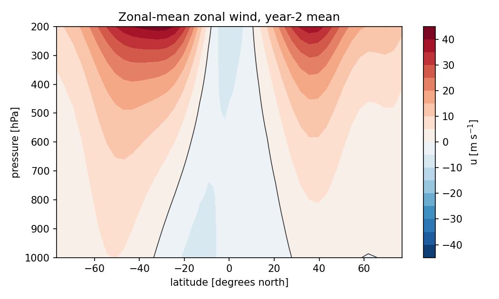
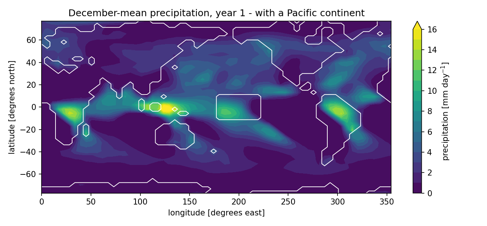
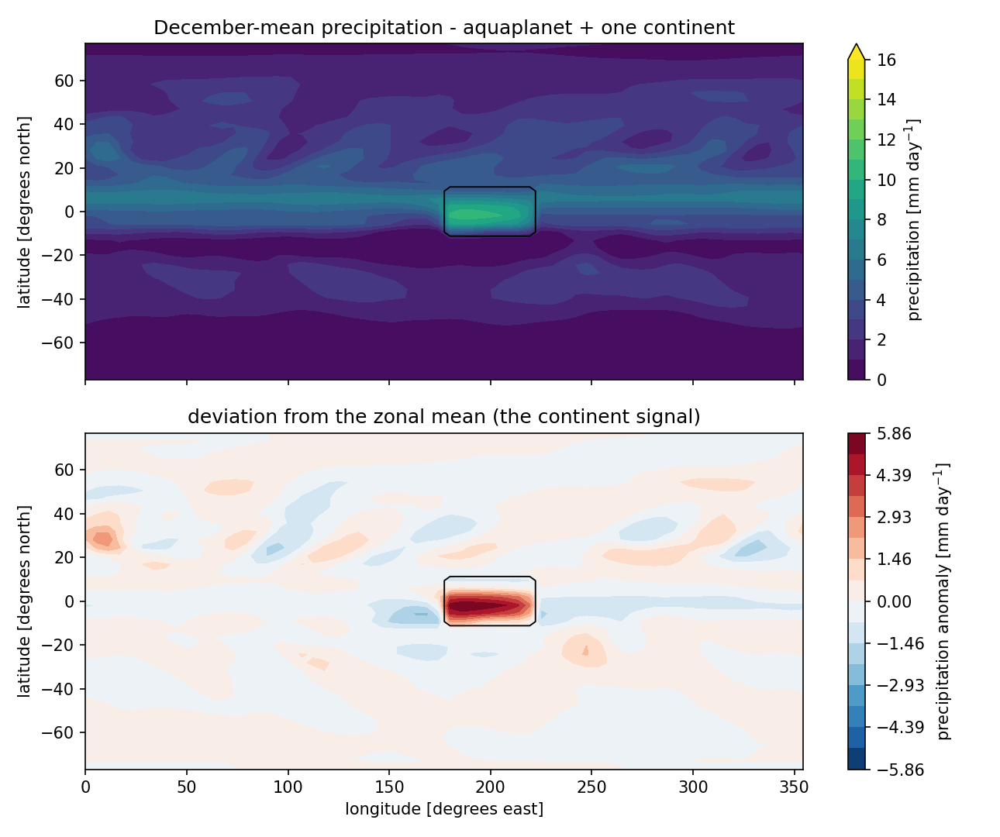

Example gallery
===============

Runnable scripts in ``examples/`` (each needs the converted boundary
registry; point ``QTCM1_BNDDATA`` at it). They are deliberately short —
the API is small, and every experiment below is a plain Python script,
not a configuration dialect.

Control run (fixed climatological SST)
--------------------------------------

The standard experiment: cold start, seasonal Reynolds SST, monthly
means with provenance, a restart file for later branching.

.. literalinclude:: ../examples/01_control_run.py
   :language: python

SST-anomaly experiment (El Niño-like patch)
-------------------------------------------

SST is a boundary condition, so anomaly runs need no model changes:
write the day loop yourself and perturb the SST before it is applied.
This is the pattern for pacemaker runs, warming patches, uniform
+2 K experiments, and observed-SST (``sst_mode='real_time'``) cases.

.. literalinclude:: ../examples/02_sst_anomaly.py
   :language: python

Idealized greenhouse forcing (CO2-like), fixed SST
--------------------------------------------------

QTCM1 v2.3 has no explicit CO2 parameter; greenhouse experiments
perturb the longwave budget. Wrapping ``radlw`` at the model's import
site gives a clean +F W/m² forcing run. Note the caveat in the script:
with prescribed SST this is the *fast* response only — for the full
response with an interactive ocean, see the slab example below.

.. literalinclude:: ../examples/03_radiative_forcing.py
   :language: python

Restarts and last-bit twins
---------------------------

Bit-exact restart round-trips, and the model's own error-growth
behavior measured with a one-ulp initial perturbation.

.. literalinclude:: ../examples/04_restart_twin.py
   :language: python

Heritage vs recommended build
-----------------------------

Not a separate script — one line. ``build='f32'`` reproduces the
historical single-precision Fortran climate; ``build='f64'`` is the
equation set as written. Comparing the two quantifies the original
model's single-precision artifact (see :doc:`validation`):

.. code-block:: python

   ControlRun(config=RunConfig(data_path=DATA, build='f32'))

Slab ocean with greenhouse forcing
----------------------------------

The full version of the experiment above: spin up with fixed SST,
diagnose the Q-flux from a control (``tools/make_qflux.py``), branch a
slab-ocean control and a slab run with +4 W/m² — now the SST responds.
The slab holds the control climatology by construction (ocean-mean
drift ~0.1 K over 90 days when branched from a spun-up state).

.. literalinclude:: ../examples/05_slab_co2.py
   :language: python

Vertical structure: zonal-mean winds on pressure levels
-------------------------------------------------------

The prognostic winds are *mode amplitudes* — barotropic ``u0`` plus
baroclinic ``u1`` — and full profiles are Galerkin reconstructions
:math:`u(p) = u_0 + V_1(p)\,u_1` (NZ 3.10). :func:`qtcm1.load_basis`
returns the vertical basis functions (:math:`a_1`, :math:`a_1^+`,
:math:`V_1`, and the closure-table profiles) as an xarray Dataset built
from the ``qtcmpar.F90`` tables, so the section below is one broadcast:

.. literalinclude:: ../examples/06_zonal_mean_winds.py
   :language: python

         at +-35 degrees, equatorial easterlies, sign reversal near 500 hPa.

One caveat carried in the Dataset attributes: the moisture basis
:math:`b_1(p)` is not tabulated in v2.3 (only its projections enter the
discrete equations), so temperature and wind profiles reconstruct but
moisture profiles do not.

Custom continents
-----------------

Geography is an input: ``stype`` and ``top`` on the model grid are all
the model knows about continents, and :mod:`qtcm1.surface` builds and
edits that pair (``real_earth()``, ``aquaplanet()``, a ``paint()``
box/mask painter). Everything downstream — land/ocean split, drag,
land-model parameters — re-derives from the surface you pass. Albedo
over *changed* points switches to static per-type values diagnosed from
the packaged climatology (``albedo_mode='auto'``); ocean created where
the registry has land triggers a warning (prescribed SST there is the
dataset's under-land fill), and slab-ocean modes refuse a custom surface
until a matching Q-flux is diagnosed (``tools/make_qflux.py``).

The script paints a flat grassland continent across the central
equatorial Pacific and maps December-mean precipitation after a one-year
run — the ITCZ reorganizes over the new landmass:

.. literalinclude:: ../examples/07_custom_continents.py
   :language: python

         rainfall organizes over the new landmass in the otherwise dry
         central Pacific.

Aquaplanet + one continent
--------------------------

The reverse construction — start from water and *add* land — isolates
a single landmass completely. ``surface.aquaplanet()`` gives all-ocean,
flat geography; painting one continent onto it, together with
``sst_mode='zonal'`` (the seasonal SST climatology zonally averaged
over the registry's ocean points, so no warm pool, no under-land fill,
observed meridional/seasonal structure retained), makes the continent
the *only* zonally asymmetric element of the run. Whatever deviates
from zonal symmetry is the continent's doing:

.. literalinclude:: ../examples/08_aquaplanet_continent.py
   :language: python

         precipitation and its zonal anomaly - the ITCZ is a symmetric
         band except over the lone landmass, where rainfall is enhanced
         by several mm/day.

The ITCZ sits just south of the equator in December everywhere except
the continent, where land-surface heating pulls convection onto the
landmass (~+6 mm/day locally) with weak compensating dry flanks along
the same latitude band.

Topography (TOPO)
-----------------

``RunConfig(topo=True)`` enables the port of the Fortran ``TOPO``
compile option: the divergence generated by topographic lifting,
:math:`\mathrm{div0} = \mathbf{v}_s \cdot \nabla\,\mathrm{TOP}` with
terrain-following surface winds (:math:`V_1` evaluated at the local
surface height from the ``V1z`` table), feeds a vortex-stretching term
:math:`-f\,\mathrm{div0}` in the barotropic vorticity equation and the
:math:`\omega`-advection terms in ``advctuv``. The source notes this
"improves northern hemisphere rainfall and flow pattern significantly".
``top`` edits via :mod:`qtcm1.surface` become dynamically active with
the flag on.

Validation status, stated precisely: the div0 stencil and vorticity
term are pinned bitwise against the actual Fortran expressions compiled
by gfortran in double precision (``tests/test_topo.py``), flat
topography is proven bitwise inert, and TOPO runs restart bit-exactly.
What v2.3's ifdef actually activates is *only* this dynamic pathway —
the thermodynamic ``GMs0r``/``GMq0r`` lifting terms are commented out
inside the ifdef in the released source and are deliberately not
ported. Full-model goldens against a ``-DTOPO`` oracle rebuild remain
on the roadmap.

Roadmap
-------

Not yet ported from the original option set: the ISCCP cloud
climatology option (``OBSCLD`` — the cloud kernel accepts the override;
reader wiring pending) and ``SPONGES``. The slab ocean is
formula-validated (unit tests + closure against the control
climatology) and TOPO is kernel-validated (see above); bit-level golden
validation against per-option Fortran rebuilds is planned for both.
Planned additions beyond option parity: budget-closing xarray
diagnostics, first-class intervention hooks (replacing the
wrap-the-routine pattern above), and a batched ensemble dimension.
