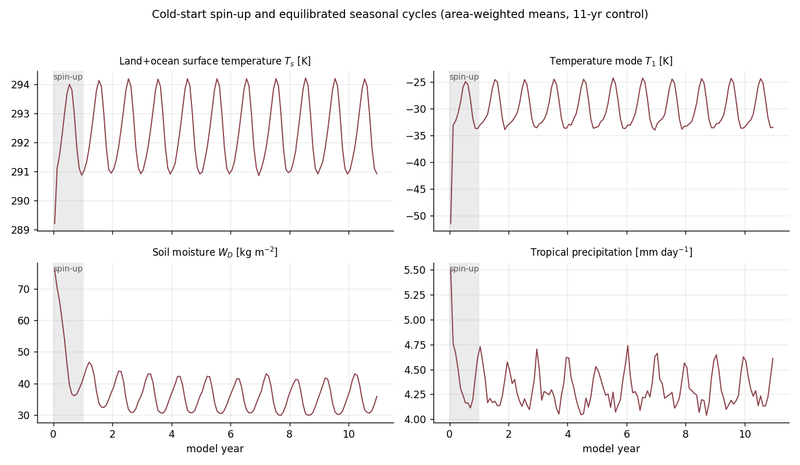
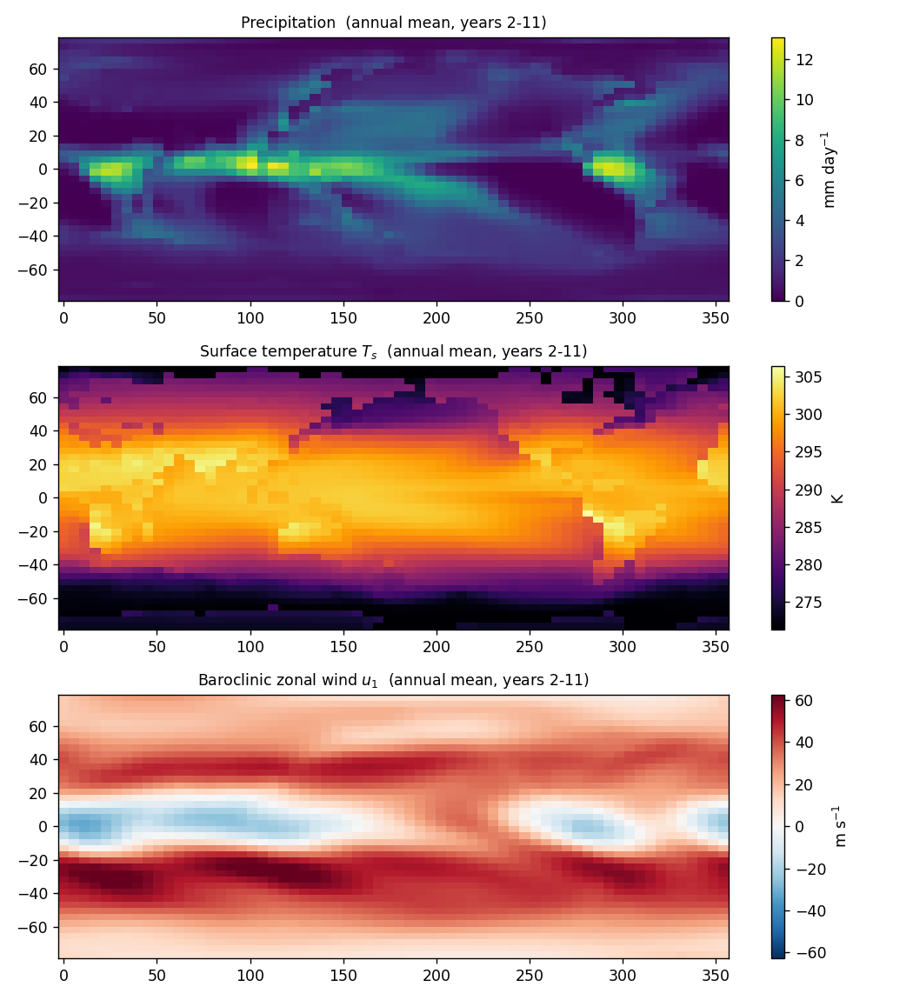

Model output
============

Requesting output
-----------------

What a run archives is declared up front as a dict mapping variable
names to a frequency and a kind, passed through
:class:`~qtcm1.config.RunConfig`:

.. code-block:: python

   cfg = RunConfig(data_path=DATA, output={
       'Ts':  {'freq': 'monthly', 'kind': 'mean'},
       'Qc':  {'freq': 'daily',   'kind': 'mean'},
       'u1':  {'freq': '6h',      'kind': 'inst'},
       'T1':  {'freq': 'step',    'kind': 'inst'},   # every time step
   })
   run = ControlRun(config=cfg)
   run.run_years(2)

   dsets = run.to_datasets()          # {'monthly': Dataset, 'daily': ..., ...}
   prec = dsets['daily']['Qc'] / 28.125
   run.save_output('myrun')           # myrun_monthly.nc, myrun_daily.nc, ...

* ``freq``: ``'step'``, ``'<n>h'`` for any divisor of 24 (``'1h'``,
  ``'6h'``, ``'12h'``, ...), ``'daily'``, or ``'monthly'``.
* ``kind``: ``'mean'`` — accumulated **every time step** over the
  interval (the Fortran ``varmean`` semantics) — or ``'inst'`` — the
  field sampled at the interval's end.
* Omitting ``output`` gives the standard monthly-mean archive
  (:data:`qtcm1.io.output.DEFAULT_OUTPUT`); unknown variable names and
  invalid frequencies are rejected at construction.

Results are :class:`xarray.Dataset` objects, one per requested
frequency: a ``cftime`` *noleap* (365-day) time axis labelled at each
interval's **end**, CF-style ``units``/``long_name``/``cell_methods``
per variable (``time: mean`` vs ``time: point``), v-grid variables on
their own ``lat_v`` coordinate, and the run's provenance (git hash,
configuration, input hashes) in the global attributes.  Partial
intervals at the end of a run are dropped.  The full variable registry
is :data:`qtcm1.io.output.VARIABLES` (currently: prognostics ``u1 v1 T1
q1 u0 v0 Ts WD us vs`` and diagnostics ``Qc Evap FTs OLR S0 FSWds FSWus
FLWds FLWus cl1 taux tauy div1 Runf wet``).

Monthly-mean files (legacy npz)
-------------------------------

``ControlRun.save_monthly(path)`` writes a compressed npz with one group
per month, means accumulated **every time step** (the Fortran
``varmean`` semantics, not daily snapshots):

.. code-block:: text

   m0000/u1, m0000/v1, ...      per-month mean fields (float32)
   m0001/...
   years, months                calendar labels per month index
   provenance                   JSON: git hash, full RunConfig,
                                boundary-data manifest hashes

Fields and units (grids: u/T fields ``(ny, nx)`` = (42, 64); v-grid
fields ``(ny+1, nx)`` with the south wall in row 0):

===========  =========================================  ==============
key          quantity                                   units
===========  =========================================  ==============
``u1, v1``   baroclinic (mode-1) winds                  m s\ :sup:`-1`
``u0, v0``   barotropic winds                           m s\ :sup:`-1`
``T1, q1``   temperature / moisture mode amplitudes     K
``Ts``       surface temperature                        K
``WD``       soil moisture (land)                       kg m\ :sup:`-2`
``Qc``       convective heating = precipitation         W m\ :sup:`-2`
``Evap``     latent heat flux                           W m\ :sup:`-2`
``FTs``      sensible heat flux                         W m\ :sup:`-2`
``OLR``      outgoing longwave at top                   W m\ :sup:`-2`
``S0``       incoming solar at top                      W m\ :sup:`-2`
``cl1``      deep-cloud fraction                        --
``taux``     zonal surface stress                       N m\ :sup:`-2`
===========  =========================================  ==============

Precipitation in mm/day is ``Qc * 86400 / L`` with the model's
:math:`L = 2.43\times10^{6}` J kg\ :sup:`-1` (divide by 28.125).
Reading a file:

.. code-block:: python

   import json, numpy as np

   z = np.load('control_monthly.npz')
   nmon = len(z['years'])
   prec = np.stack([z[f'm{i:04d}/Qc'] for i in range(nmon)]) / 28.125
   meta = json.loads(bytes(z['provenance']).decode())
   print(meta['code_git'], meta['config']['build'])

Restart files hold the complete :class:`~qtcm1.model.ModelState` (plus
slab-ocean state when active) and round-trip bit-exactly; they are not
an analysis format.

Spin-up
-------

A cold start (``varinit``: :math:`T_1 = -100` K, :math:`q_1 = -50` K,
:math:`T_s = 295` K everywhere, 70 %-saturated soil) equilibrates fast:
the atmosphere within weeks, soil moisture over ~1–2 years. Discard at
least the first year (the Tier-3 comparisons here discard year 1; the
Fortran baseline discards five).

The grey band marks year 1. :math:`T_s` and tropical precipitation lock
onto the seasonal cycle almost immediately (ocean :math:`T_s` is
prescribed in this configuration); the land bucket ``WD`` takes the
longest to forget the 70 % initial fill.

Steady state
------------

Annual-mean climatology of the same run, years 2–11 — the fields the
Tier-3 validation compares against the Fortran control (see
:doc:`validation`):

The familiar QTCM1 climate: ITCZ/SPCZ and monsoon precipitation maxima,
the warm pool, and the baroclinic subtropical jets in :math:`u_1`.
